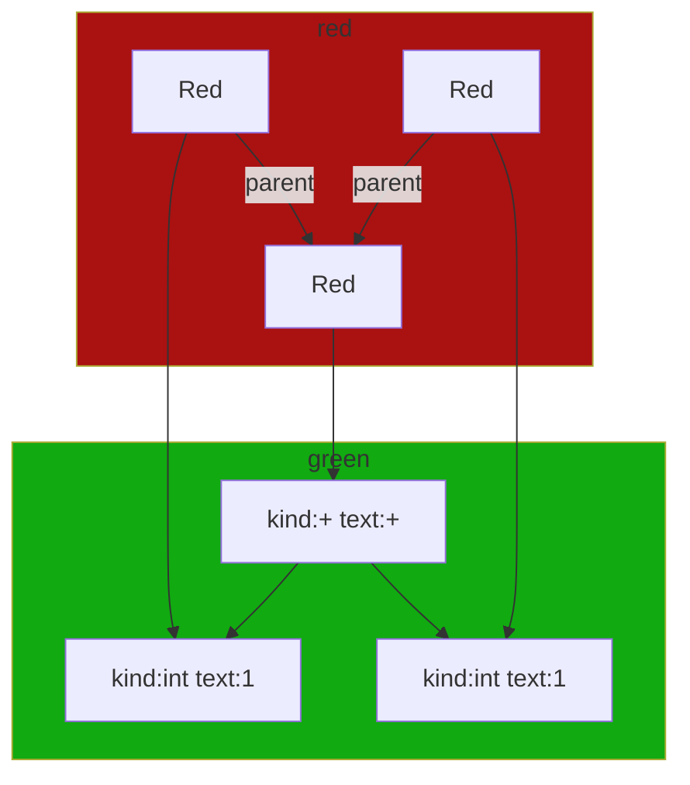

## 概要

本記事では、新しい言語処理系でしばしば称されている Red Green Tree あるいは Lossless Syntax Tree と呼ばれる構文木について解説します。

### 発明と浸透

このデータ構造は、Roslyn のチームによって発明されました。

後述するいくつかの特徴的で顕著なメリットを有しており、近年の言語処理系で採択されるケースが増えています。

具体的には以下の処理系で採用されています。

- Swift (libsyntax)
- Kotlin
- rust-analyzer
- oil-shell
- biome(旧rome)

### 名称

Lossless Syntax Tree と Red Green Tree の二つの名称には微妙な違いがあります。

Red Green Tree とは Roslyn で発明されたデータ構造であり、本記事で解説するものです。

Lossless Syntax Tree とは、その名前の通り Lossless であることに着目します。Red Green Tree またはそれに近いデータ構造であることが多いですが、この名前で言及されているものは必ずしも Red Green Tree であるとは限りません。

## 解説

まずは Red Green Tree の概略図を見てみましょう。基本的な構造はこの図から抑えられると思います。

全体を把握したうえで、この構造の特徴とメリットについて解説し、各種操作等の細部の開設へと移ります。


### 概略図

```typescript
interface RedNode {
    parent: RedNode
    green: GreenNode
}

interface GreenNode {
    text_len: number // u32
    children: Array<GreenNode | Token>
}

type Syntaxkind = number // u32
interface Token {
    kind: SyntaxXind
    text: string
}
```



# Green Node

子のリストを持つ
Red Node を通して差し替える

# Red Node

GreenNode のラッパー的なもの
親への参照を持つ
GreenNode への参照を持つ
サイズが小さい

- 子のリスト取得
    - GreenNode は子のリストを持っている
    - GreenNode から子のリストの GreenNode を取得。
    - 自身を親に、取得した GreenNode を持つ RedNode を作成できる

- 差し替え
    - 子は毎回作成されるので、GreenNode を差し替えれば、子も自動的に差し替えられる
    - 親のGreenNodeの子を差し替えた新しいGreenNodeを作成する。この時点では木全体に変更が反映されない
    - RedNodeの親をたどり、子を差し替えたGreenNodeへと入れ替えていく
    - 親がなくなったら停止する。この時点でルートまですべてのノードが差し替えられる
    - その性質上、差し替えコストは深さに依存するため、全書き換えよりも効率が良い
